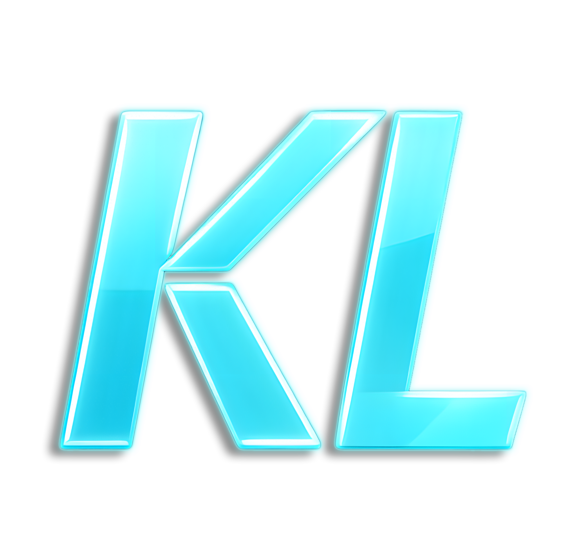

*KoraLabs video service*

---

A modern video sharing platform built with Next.js, Firebase, and Google Cloud Services.

## Project Overview

This is a complete video sharing platform that allows users to upload, process, and watch videos. The system follows a cloud-native architecture with separation of concerns between frontend, backend functions, and processing services.

## System Architecture

The platform consists of three main components:

### 1. Web Client (`koralabs-web-client`)
- Built with Next.js (App Router)
- Firebase authentication integration
- Responsive UI with upload and watch functionality
- Video listing and embedded player

### 2. Firebase Functions (`video-api-service/functions`)
- User creation on authentication triggers
- Signed URL generation for video uploads
- Video listings retrieval
- Firestore integration for data persistence

### 3. Video Processing Service (`video-processing-service`)
- Video processing pipeline (download, convert to 360p, re-upload)
- Google Cloud Storage integration
- Firestore status tracking
- Error handling and cleanup procedures

## Features

- User authentication with Firebase Auth
- Direct-to-Cloud video uploads using signed URLs
- Automated video processing pipeline
- Video listing and watching pages
- Responsive web interface

## Technology Stack

### Frontend
- Next.js 16.1.6
- React 19.2.3
- TypeScript
- Firebase SDK

### Backend
- Firebase Functions (Node.js 20)
- Express.js
- Google Cloud Storage
- Firestore
- fluent-ffmpeg for video processing

### Infrastructure
- Docker (containerized services)
- Google Cloud Platform services

## System Flow

1. **User Authentication**: Users sign in via Firebase Auth
2. **Video Upload**:
   - Client requests signed URL from Firebase function
   - Video uploaded directly to Google Cloud Storage
3. **Processing Trigger**:
   - Pub/Sub message triggers video processing service
4. **Video Processing**:
   - Raw video downloaded locally
   - Converted to 360p resolution
   - Processed video uploaded back to Cloud Storage
5. **Status Update**: Firestore updated with processing status
6. **Video Watching**: Users can watch processed videos via embedded player

## Development Stages

This project was built in stages:
- Stage 1: Initial setup
- Stage 2: Docker implementation
- Stage 3: Google Cloud integration
- Stage 4: Web App development
- Stage 5: Firebase integration
- Stage 6: Upload & Watch functionality

## Getting Started

### Prerequisites
- Node.js 20+
- Firebase CLI
- Google Cloud account with appropriate permissions
- Docker (for local development)

### Setup Instructions
1. Clone the repository
2. Install dependencies for each service:
   - `cd koralabs-web-client && npm install`
   - `cd video-api-service/functions && npm install`
   - `cd video-processing-service && npm install`
3. Configure Firebase and Google Cloud credentials
4. Run the development servers for each component

## Contributing

This project is a complete implementation of a video sharing platform. Contributions would focus on:
- Improving error handling
- Adding new features
- Performance optimizations
- Documentation enhancements

## License

This project is a demonstration implementation and does not have an explicit license specified.