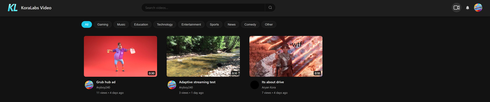
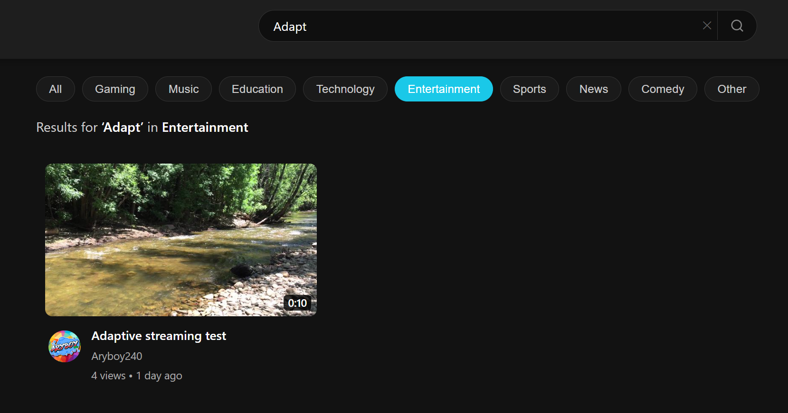
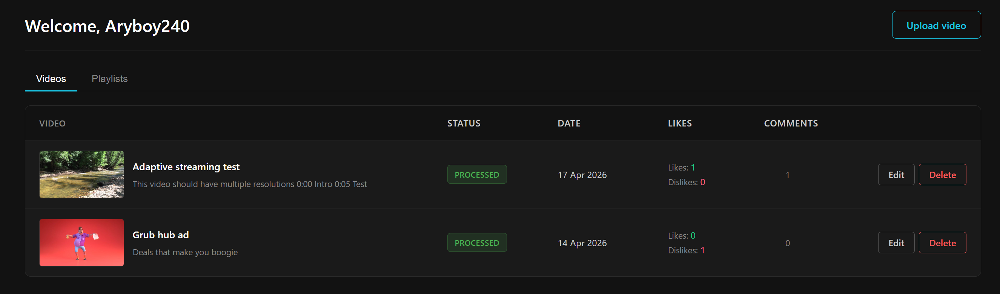
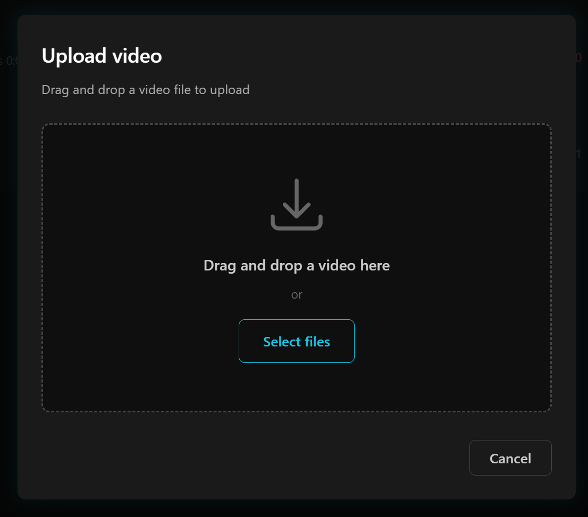
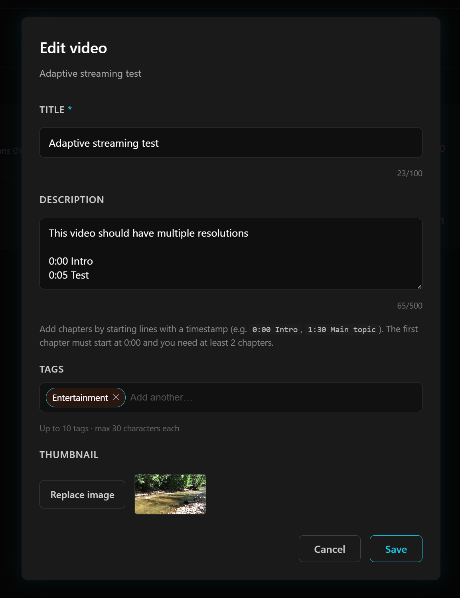
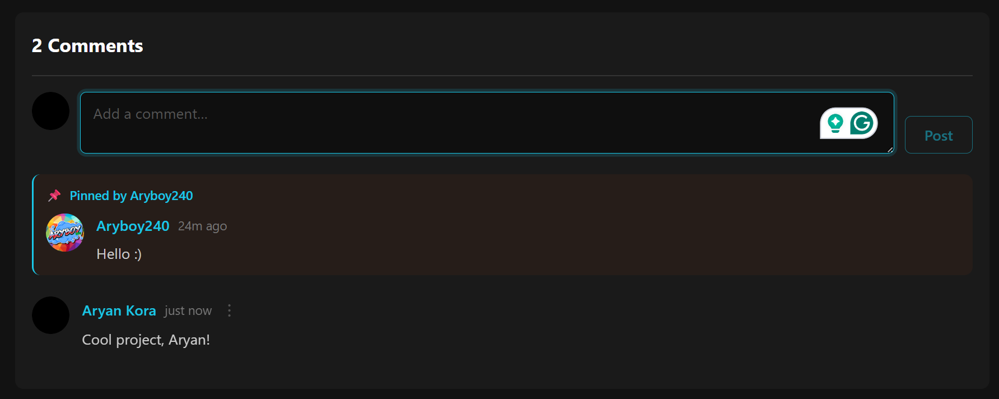
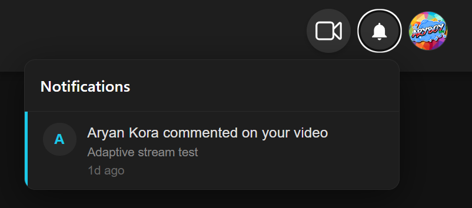
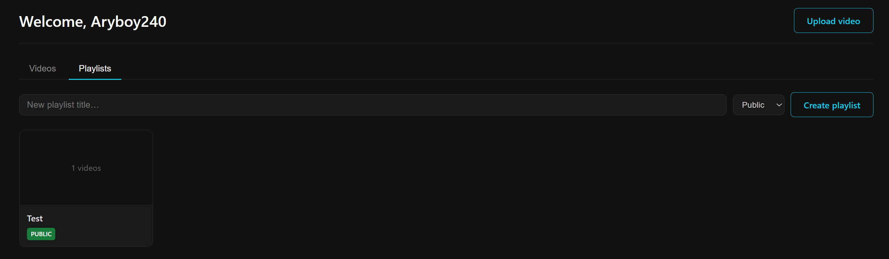
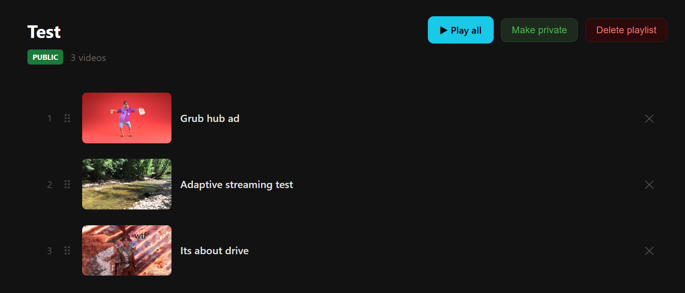
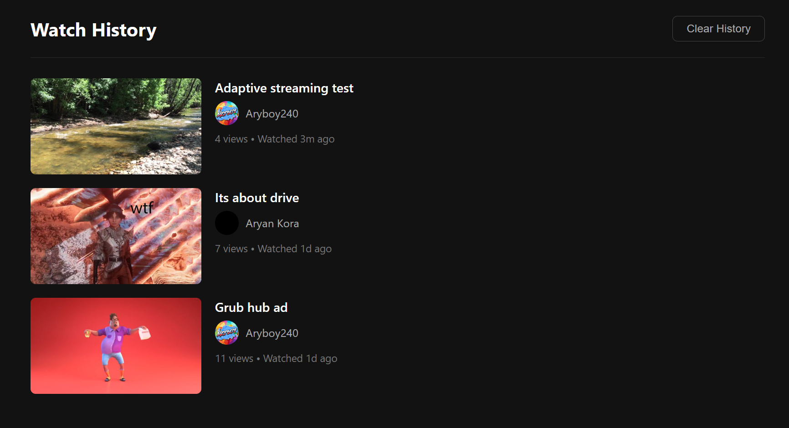

<div align="center">
  
</div>

# KoraLabs Video — Cloud-Native Video Sharing Platform


A full-stack video sharing platform built on Google Cloud Platform. Videos are uploaded directly from the browser to Cloud Storage via signed URLs, automatically transcoded into multi-resolution HLS adaptive bitrate streams by a containerised FFmpeg pipeline on Cloud Run, and played back through a custom hls.js player that adjusts quality in real time based on network conditions. The platform includes a complete social layer — comments, likes, subscriptions, notifications, playlists, and watch history — alongside a creator studio and admin panel.

---

## Home Page

The home page displays all published videos in a responsive card grid. Category filter pills let users browse by tag, a live search bar filters results as you type, and each thumbnail card shows a duration overlay, uploader name, and view count. Thumbnails are served as Sharp-compressed variants — never the original upload.

<p align="center">
  
  
</p>

---

## Video Playback

The watch page features a fully custom video player built on the HTML5 `<video>` API and hls.js — no third-party player UI. It supports adaptive bitrate streaming, manual quality selection, playback speed control, and keyboard shortcuts (Space, arrow keys, F, M). A buffered-progress indicator and buffering spinner give clear visual feedback during loading.

When a video description contains timestamps (`0:00 Intro`, `1:30 Section`), chapter markers are rendered on the progress bar and a clickable chapter list appears below the description. If the video is part of a playlist, a sidebar shows the full track list with current position, previous/next navigation, and auto-advance on video end. A share button copies the page URL to clipboard with a toast confirmation.

<p align="center">
  
</p>

---

## Studio & Upload

The studio dashboard lists all of a creator's videos with live processing status. The upload modal accepts a video file, title, description, tags, and optional thumbnail — uploading directly to Cloud Storage via a v4 signed URL, with a real-time progress bar driven by `XMLHttpRequest.upload.onprogress`.

While the video processes, the studio card polls Firestore every 5 seconds and advances a labelled progress bar through stages: *Downloading → Transcoding → Uploading → Processed*. Existing videos can be edited inline — title, description, tags, and thumbnail — without re-uploading.

<p align="center">
  
  
</p>


<p align="center">
  
  
</p>

---

## Social Features

Comments support inline editing, deletion (owner only), and pinning (video owner only). Pinned comments are fetched separately and rendered at the top with a distinct banner. Likes and dislikes are mutually exclusive and updated atomically via Firestore transactions. Users can subscribe to channels with subscriber counts maintained via `FieldValue.increment`.

The notification bell in the navbar shows an unread badge and lists recent activity — new comments on your videos, likes, and new subscribers — updated every 60 seconds, with a mark-all-read action.

<p align="center">
  
  
</p>

---

## Playlists

Users can create public or private playlists, add videos from the watch page, and manage them from the studio. The playlist page supports drag-to-reorder via the HTML5 Drag and Drop API with optimistic UI updates, and remove-from-playlist. Watching a playlist opens a sidebar with the full track list, a position indicator (e.g. *3 / 7*), previous/next navigation, and auto-advance when a video ends. Visibility toggles between public and private at any time.

<p align="center">
  
  
</p>

---

## Watch History

Every video watched for more than 3 seconds is recorded in the user's watch history. The history page shows all viewed videos with timestamps and a clear-history option. The *Up Next* sidebar on the watch page deprioritises videos seen in the last 24 hours and randomly selects from the remaining pool — providing varied suggestions across page loads.

<p align="center">
  
</p>

---

## Architecture

```
Browser
  │
  ├── Firebase Cloud Functions (API) ─────── Firestore
  │       (europe-west2, v2 onCall)         (metadata, social, playlists)
  │
  ├── Cloud Storage ──── koralabs-raw-videos ──── Pub/Sub ──── Cloud Run
  │   (signed URL              (raw uploads)      OBJECT_     (FFmpeg pipeline)
  │    direct upload)                             FINALIZE         │
  │                                               trigger          ├─ 360p / 480p / 720p / 1080p HLS
  │                                                                ├─ {videoId}/ folder in GCS
  │                                                                └─ Firestore progress updates
  │
  └── koralabs-processed-videos  (public CDN)
        ├── {videoId}/*.ts  +  {videoId}/*_master.m3u8
        ├── thumbnails/small/{videoId}.jpg
        ├── thumbnails/medium/{videoId}.jpg
        └── avatars/{uid}.jpg
```

**Web client** — Next.js 15 App Router on Cloud Run. All pages are client-rendered; data is fetched from Firebase Functions via the `httpsCallable` SDK.

**API layer** — 30+ Firebase Cloud Functions v2 (`onCall`, europe-west2) covering authentication triggers, signed URL generation, video CRUD, comments, likes, subscriptions, notifications, playlists, watch history, thumbnail processing, and admin operations.

**Video processing service** — Node.js/Express on Cloud Run, triggered by Pub/Sub push messages. Downloads the raw file, runs FFmpeg for each resolution variant, generates a master HLS playlist, uploads all files to the processed bucket under a `{videoId}/` prefix, and writes progress to Firestore throughout.

---

## Tech Stack

| Layer | Technology |
|---|---|
| Frontend | Next.js 15.3, React 19, TypeScript 5, hls.js 1.6, CSS Modules |
| API | Firebase Cloud Functions v2 (`onCall`) |
| Database | Firestore (named DB: `koralabs-video-web-client`) |
| Auth | Firebase Authentication — Google OAuth |
| Video Processing | FFmpeg (fluent-ffmpeg 2.1), Sharp, Node.js, Express 5 |
| Storage | Google Cloud Storage (`koralabs-raw-videos`, `koralabs-processed-videos`) |
| Messaging | Google Cloud Pub/Sub |
| Hosting | Google Cloud Run (Docker), europe-west2 |

---

## How It Works

### Upload Pipeline

1. Client calls `generateUploadUrl` with file extension, title, description, tags, and optional thumbnail extension
2. Function creates a Firestore video document (`status: "uploading"`) and returns a v4 signed URL (15-minute expiry) for direct upload to `koralabs-raw-videos`
3. Browser uploads via `XMLHttpRequest PUT` — bypassing the API layer entirely — with `upload.onprogress` driving the studio progress bar
4. Cloud Storage fires an `OBJECT_FINALIZE` Pub/Sub push notification to the processing service

### HLS Transcoding

```
-vf scale=-2:{height}
-c:v libx264 -crf 23 -preset fast
-g 144 -keyint_min 144
-force_key_frames expr:gte(t,n_forced*6)
-c:a aac
-hls_time 6 -hls_list_size 0 -hls_playlist_type vod
-hls_segment_filename {videoId}/{videoId}_{label}_%03d.ts
```

Four resolution tiers: **1080p** (5 Mbps) · **720p** (2.8 Mbps) · **480p** (1.4 Mbps) · **360p** (800 kbps). The source is probed with `ffprobe` first; variants above the source height are skipped; 360p is always generated. The master playlist is written in ascending order (360p → 1080p) so hls.js level 0 maps to the lowest quality. The 6-second segment duration matches the GOP size exactly (144 frames at 24 fps), with `force_key_frames` ensuring every segment starts with an IDR keyframe.

### Adaptive Bitrate Streaming

```typescript
abrEwmaDefaultEstimate: 150000, // 150 kbps → always starts at 360p
abrBandWidthFactor: 0.75,       // downswitch if bandwidth < 75% of current bitrate
abrBandWidthUpFactor: 0.55,     // upswitch only if bandwidth > 1.82× target bitrate
testBandwidth: false,           // disables startup probe that would load 1080p first
maxBufferLength: 30,
```

`testBandwidth: false` is critical — with the default `true`, hls.js probes bandwidth by downloading a fragment from the *highest* quality level on startup, causing 1080p to load first regardless of connection speed. On `MANIFEST_PARSED`, the player is forced to level 0 then handed back to ABR, ensuring playback always begins at 360p and ramps up based on observed download speeds.

### Thumbnail Processing

After upload, Sharp generates two compressed JPEG variants in parallel:

| Variant | Dimensions | Quality | Use |
|---|---|---|---|
| Small | 640 × 360 | 80 | Video card grids, home page |
| Medium | 1280 × 720 | 85 | Watch page poster image |

Original uploads (~1.8 MB) are never served to browsers. Compressed variants average **45 KB** small / **68 KB** medium — a 95–97% reduction. User avatars are mirrored from Google's CDN to GCS at 256×256 JPEG quality 90 on first sign-in to ensure stable, tracking-free URLs.

---

## Performance

| Metric | Before | After |
|---|---|---|
| Thumbnail payload per image | ~1.8 MB | ~45 KB (97% reduction) |
| Home page total thumbnail data (12 cards) | ~21.6 MB | ~540 KB |
| Watch page initial load time | ~38 s | ~2–3 s |
| HLS startup quality | 1080p (misconfigured) | 360p → ramps to 1080p in ~10 s |
| Comments Firestore reads on page load | Always | Only when scrolled into view (IntersectionObserver) |

The watch page improvement came from replacing `getVideos()` (fetching all videos then filtering client-side) with a direct `getVideoById` Firestore document lookup, combined with parallelising the uploader profile, like status, and subscription status fetches via `Promise.all`.

---

## Getting Started

### Prerequisites

- Node.js 20+
- Docker
- [Google Cloud SDK](https://cloud.google.com/sdk/docs/install) (`gcloud`)
- [Firebase CLI](https://firebase.google.com/docs/cli) (`npm install -g firebase-tools`)
- A Google Cloud project with billing enabled, linked to a Firebase project

### Environment Setup

**Web client** — create `koralabs-web-client/.env.local` with your Firebase project config:

```env
NEXT_PUBLIC_FIREBASE_API_KEY=
NEXT_PUBLIC_FIREBASE_AUTH_DOMAIN=
NEXT_PUBLIC_FIREBASE_PROJECT_ID=
NEXT_PUBLIC_FIREBASE_STORAGE_BUCKET=
NEXT_PUBLIC_FIREBASE_MESSAGING_SENDER_ID=
NEXT_PUBLIC_FIREBASE_APP_ID=
```

**Processing service** — uses Application Default Credentials on Cloud Run (service account). For local development, set `GOOGLE_APPLICATION_CREDENTIALS` to a service account key JSON with Storage, Firestore, and Pub/Sub permissions.

**Firebase Functions** — run `firebase use <project-id>` inside `video-api-service/`. Functions use ADC automatically when deployed.

### Local Development

```bash
# Web client — http://localhost:3000
cd koralabs-web-client && npm install && npm run dev

# Firebase Functions emulator
cd video-api-service && firebase emulators:start --only functions,firestore

# Processing service (requires local GCP credentials)
cd video-processing-service && npm install && npm run start
```

### Deployment

**1 — Firebase Functions**
```bash
cd video-api-service && firebase deploy --only functions
```

**2 — Video Processing Service**
```bash
# One-time: authenticate Docker with Artifact Registry
gcloud auth configure-docker europe-west2-docker.pkg.dev

cd video-processing-service
docker build -t europe-west2-docker.pkg.dev/video-sharing-project-koralabs/video-sharing-project/video-sharing-project .
docker push europe-west2-docker.pkg.dev/video-sharing-project-koralabs/video-sharing-project/video-sharing-project

gcloud run deploy video-processing-service \
  --image europe-west2-docker.pkg.dev/video-sharing-project-koralabs/video-sharing-project/video-sharing-project \
  --region=europe-west2 \
  --platform managed \
  --timeout=3600 \
  --memory=2Gi \
  --cpu=1 \
  --min-instances=0 \
  --max-instances=1 \
  --ingress=internal
```

**3 — Web Client**
```bash
cd koralabs-web-client
docker build -t europe-west2-docker.pkg.dev/video-sharing-project-koralabs/koralabs-web-client-repo/koralabs-web-client .
docker push europe-west2-docker.pkg.dev/video-sharing-project-koralabs/koralabs-web-client-repo/koralabs-web-client

gcloud run deploy koralabs-web-client \
  --image europe-west2-docker.pkg.dev/video-sharing-project-koralabs/koralabs-web-client-repo/koralabs-web-client \
  --region=europe-west2 \
  --platform managed \
  --timeout=3600 \
  --memory=2Gi \
  --cpu=1 \
  --min-instances=0 \
  --max-instances=1
```

**GCS Infrastructure** (one-time setup)
```bash
# Create buckets
gsutil mb -l europe-west2 --pap=enforced gs://koralabs-raw-videos
gsutil mb -l europe-west2 gs://koralabs-processed-videos

# Pub/Sub notification on raw bucket (triggers processing service)
gsutil notification create -t video-uploads-topic -f json -e OBJECT_FINALIZE gs://koralabs-raw-videos

# Apply CORS policy (required for signed URL browser uploads)
gcloud storage buckets update gs://koralabs-raw-videos --cors-file=utils/gcs-cors.json
```

---

## Project Structure

```
koralabs/
├── koralabs-web-client/            # Next.js 15 frontend
│   ├── app/
│   │   ├── page.tsx                # Home — video grid, category filters, search
│   │   ├── watch/page.tsx          # Player — HLS, chapters, playlist sidebar
│   │   ├── studio/page.tsx         # Creator dashboard — upload, edit, playlists
│   │   ├── channel/[uid]/          # Public channel pages
│   │   ├── playlist/[playlistId]/  # Playlist management & player
│   │   ├── history/page.tsx        # Watch history
│   │   ├── navbar/                 # Navbar, sign-in, notification bell
│   │   ├── not-found.tsx           # 404 page
│   │   └── firebase/               # Firebase client config & typed function wrappers
│   └── Dockerfile
├── video-api-service/              # Firebase Cloud Functions
│   └── functions/src/index.ts     # 30+ API endpoints
├── video-processing-service/       # Cloud Run transcoding service
│   ├── src/
│   │   ├── index.ts                # Express server — Pub/Sub handler, pipeline
│   │   └── storage.ts              # FFmpeg HLS transcoding, GCS upload, ffprobe
│   └── Dockerfile
├── screenshots/                    # UI screenshots
├── utils/gcs-cors.json             # CORS policy for raw-videos bucket
├── DEVLOG.md                       # Full development log (Oct 2025 — Apr 2026)
└── README.md
```

---

## Firestore Collections

| Collection | Contents |
|---|---|
| `videos` | `title`, `description`, `tags`, `hlsMasterUrl`, `thumbnailSmallUrl`, `thumbnailMediumUrl`, `duration`, `viewCount`, `likeCount`, `dislikeCount`, `status`, `processingStage`, `progress` |
| `users` | `displayName`, `email`, GCS `photoUrl`, `subscriberCount` |
| `videos/{id}/comments` | `text`, `uid`, `pinned`, `createdAt`, `editedAt` |
| `videos/{id}/likes` | Per-user like/dislike records for atomic transaction toggling |
| `playlists` | `title`, `uid`, ordered `videoIds[]`, `visibility` (`public`/`private`) |
| `users/{uid}/notifications` | `type`, `fromUid`, `videoId`, `read`, `createdAt` |
| `watchHistory` | `uid`, `videoId`, `watchedAt` — used for Up Next filtering |
| `admins` | UID allowlist checked by `requireAdmin()` in admin Functions |

---

## Academic Context

This platform was built as a CS3IP final-year individual project at Aston University (Computer Science BSc Hons), supervised by Shereen Fouad. The project demonstrates cloud-native architecture, distributed multimedia processing, and adaptive bitrate streaming using industry-standard technologies across a three-service GCP deployment — from raw browser upload through containerised FFmpeg transcoding to hls.js adaptive playback.
